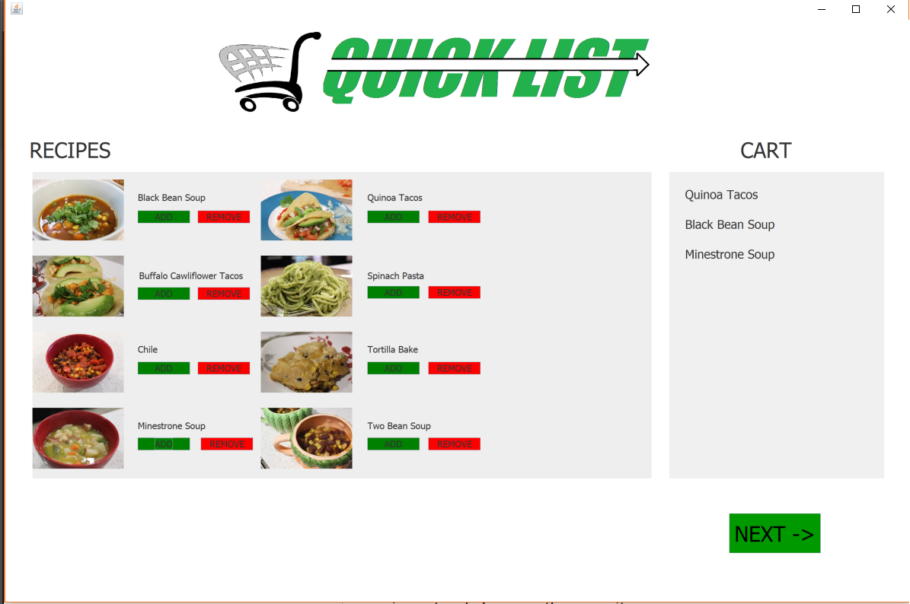
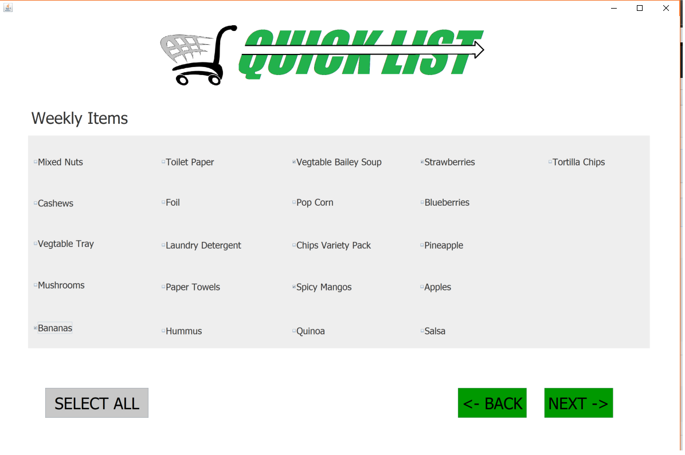
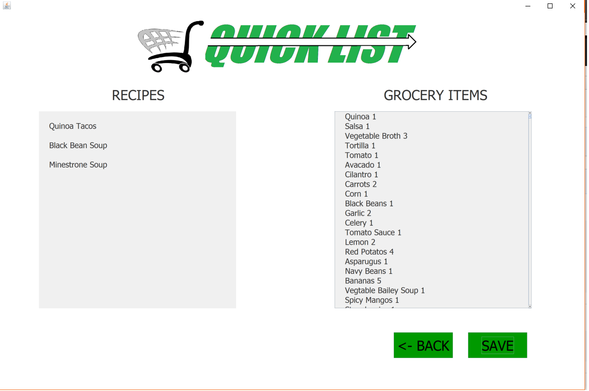
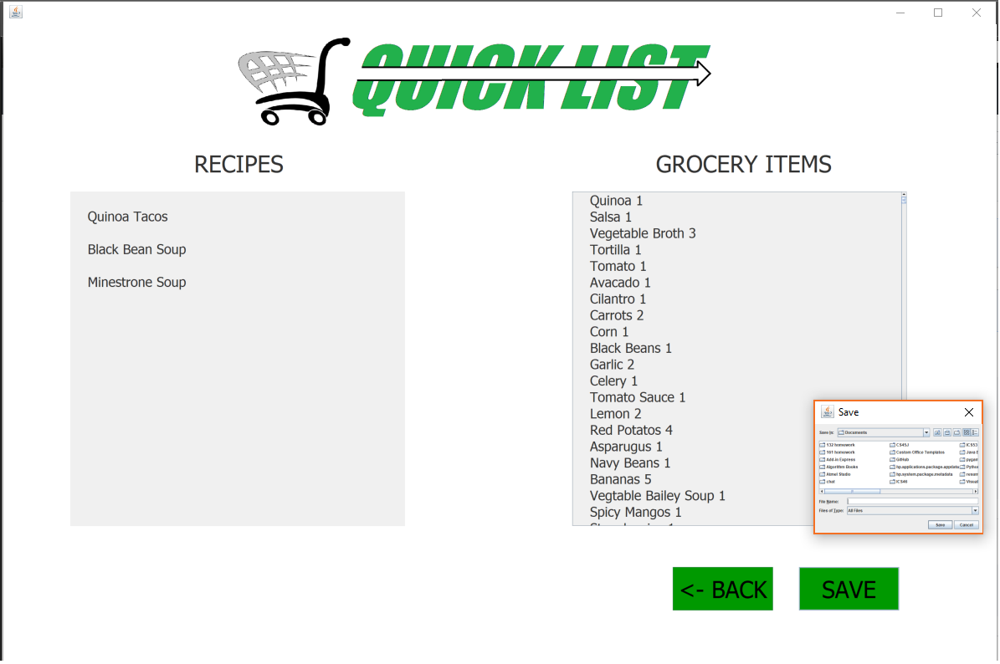

# QuickList2
## Discription:
#### This program is used to auto generate a custom grocery list. The program is built using java swing and can run on Linux, Windows and MAC operating systems. The program contains a graphical user interface that helps guide the user though the program. The first window allows the user to select recipes that they normally make in any given week.

#### The second window allows the user to select random items that are not part of a recipe. The user can select these items by clicking on check boxes near the item.

#### The third window gives a summary of recipes and items that the user has choosen. Then if satified the user may select save and a window file explorer will open and the user may navigate the file and save the document as a .DOC. The program will auto generate a recipe list and which store to buy it from.

